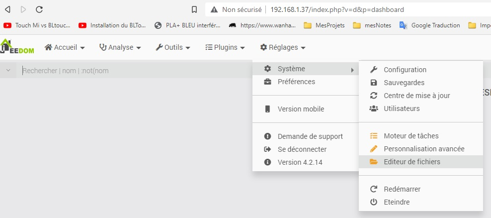
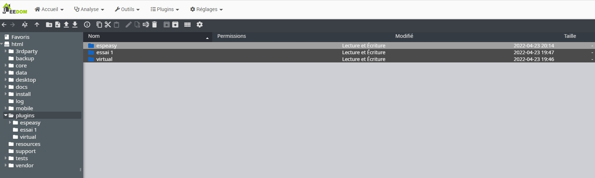
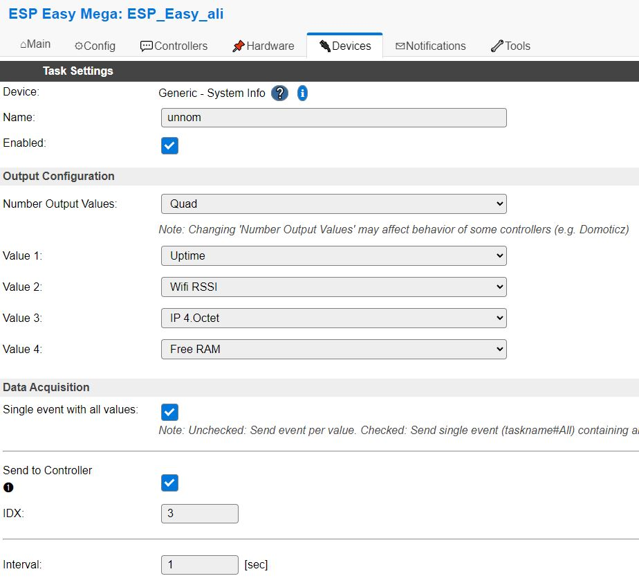

++++++++++++++++++++++++++++++++++++++++++++++++++++++++++++++++++++++++++++++++++++++++++++++++++++
Presentation
++++++++++++++++++++++++++++++++++++++++++++++++++++++++++++++++++++++++++++++++++++++++++++++++++++

:Auteur: Jean-Louis, Ali, J.Soranzo 
:Date de création: 04/2022
:Date dernière maj: 04/2022
:Societe: VoRoBoTics
:Entity: VoLAB

.. contents::
    :backlinks: top

.. |clearer|  raw:: html

    

====================================================================================================
Quoi
====================================================================================================
Jeedom sur un Raspberry pi

Avec ESPEasy

Jeedom version : 4.2.14

====================================================================================================
Note rapide
====================================================================================================
Connexion ESPEasy to Jeedom le 23/04/2022.

Passer jeedom en mode inclusion après avoir installer le plugin. Via le market il n'y a pas le choix.

Pour supprimer un plugin récalcitrant
----------------------------------------------------------------------------------------------------

|clearer|

Supprimer le dossier:

Réussir le mode inclusion
----------------------------------------------------------------------------------------------------
Site bien utile : http://domotics.fr/index.php/author/admin/page/5/

Mettre Jeedom en mode inclusion : facile

Faire émettre des donnée au wemos qui continet ESPEasy :

add new device : Generic - System Info et lui faire remonter n'importe quoi toute les secondes.

====================================================================================================
Weblinks
====================================================================================================

.. target-notes::